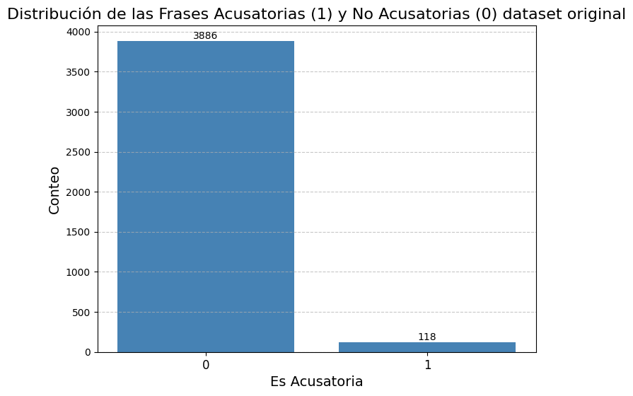

# Clasificaciónn de frases del portal de compras públicas del Ecuador en acusatorio y NO acusatorio

## Introducciónn

En el ámbito de las compras públicas en Ecuador, la fase de preguntas y respuestas entre proveedores y entidades gubernamentales se presenta como una ventana hacia las dinámicas de interacción en estos procesos. Esta etapa es crucial, ya que permite identificar preocupaciones significativas que pueden incluir acusaciones de favoritismo o corrupción. Tales acusaciones, si no se gestionan correctamente, pueden socavar la integridad de todo el proceso de licitación.
El desafío principal radica en la capacidad de clasificar de manera eficiente y precisa estas preguntas en categorías de acusatorias y no acusatorias. Actualmente, la clasificación manual no solo es ineficiente, sino también susceptible a sesgos y errores. En este contexto, la aplicación de tecnologías avanzadas de procesamiento de lenguaje natural, específicamente el uso de modelos de lenguaje como RNN, LSTM o GRU, promete mejorar significativamente la precisión y la velocidad de esta clasificación .
Este estudio propone el desarrollo de un sistema automatizado que utiliza las 3 tecnicas anteriores mencionadas para la clasificación textual y ChatGPT para la generación de datos de entrenamiento adicionales, con el objetivo de crear un modelo robusto capaz de discernir entre comentarios acusatorios y no acusatorios en el contexto de las licitaciones públicas. La implementación de tal sistema no solo podría mejorar la eficiencia del proceso de revisión de preguntas y respuestas, sino también fortalecer la transparencia y la equidad en las compras públicas .

## Augmento de datos

Inicialmente, el conjunto de datos completo fue dividido en dos segmentos principales: un 80% (4004frases) destinado para el entrenamiento y un 20% (1001 frases) reservado para la prueba. Teniendo 3886 frases de la clase 'NO Acusatorio' y 118 frases de la clase 'Acusatoria'
Dado el desequilibrio notable en la distribución de clases observado en el dataset, con una predominancia de frases no acusatorias, se implementó un proceso de aumento de datos para mejorar este desequilibrio. 

<div style="text-align:center">
  
</div>

####imagen####

Se utilizó un metodo de promting y el modelo GPT-4o-mini de OpenAI, generamos 5027 nuevas frases acusatorias. Este enfoque aumentó significativamente el número de frases acusatorias, ayudando a mejorar el entrenamiento del modelo.
Después de aplicar el aumento de datos, se obtuvo un total de 9031 frases en total (3886 frases para la clase “No Acusatoria”, y 5145 frases para la clase “Acusatoria”).

###imagen####

## Preprocesamiento de datos
### 1. Tokenización
Se realizó la tokenización del texto con el fin de segmentarlo en palabras individuales o "tokens". Para ello, se utilizó el método word_tokenize, el cual permite dividir cada frase en una secuencia de palabras. Adicionalmente, se convirtió todo el texto a minúsculas para normalizar las entradas y evitar que diferencias en el uso de mayúsculas introdujeran ruido en el procesamiento.

### 2. Eliminación de Stop Words
Se procedió a eliminar las stop words del texto, que son palabras funcionales de alta frecuencia que no aportan información significativa para el análisis de contenido. El conjunto de stop words utilizado fue el proporcionado por la biblioteca NLTK en español. Este paso es crucial para reducir el volumen de información irrelevante y optimizar el desempeño del modelo, dado que palabras como "el", "de", y "y" no contribuyen significativamente a la comprensión semántica del texto.

### 3. Stemming (Raíces de Palabras)
Para reducir las palabras a su forma raíz, se aplicó la técnica de stemming mediante el uso del algoritmo de Porter (PorterStemmer). Este proceso permitió reducir variaciones morfológicas de una palabra a una raíz común, facilitando el tratamiento de palabras con formas flexionadas de manera uniforme. Aunque el stemming puede generar raíces no léxicas, su uso es útil para reducir la dimensionalidad del vocabulario sin perder generalidad en las palabras claves.

### 4. Lematización
Se aplicó la lematización para transformar las palabras en su forma base o lema, utilizando el algoritmo WordNetLemmatizer. A diferencia del stemming, este método asegura que las palabras se conviertan a una forma válida en el idioma, mejorando la precisión en comparación con el simple recorte de sufijos. La lematización permite conservar el significado completo de las palabras, lo que es fundamental cuando se trabaja con textos que requieren análisis semántico más detallado.

###imagen###ig¿magen###

## Entrenamiento
### RNN
#### 1. Definición de la Arquitectura RNN
Se implementó una red neuronal recurrente (RNN) denominada SentimentRNN, con el propósito de capturar las dependencias secuenciales en las representaciones de texto para el análisis de sentimientos. La arquitectura incluye una capa de embeddings (nn.Embedding), que mapea cada palabra en un vector de dimensión fija, seguido de una capa recurrente simple (nn.RNN) que modela la relación entre palabras en secuencias. La capa final es una capa totalmente conectada (nn.Linear) que convierte la última salida de la secuencia en una predicción sobre las dos clases de salida: acusatoria o no acusatoria. Esta configuración permite que el modelo aprenda patrones temporales en las secuencias de texto, lo cual es fundamental en el procesamiento de lenguaje natural.

#### 2. Entrenamiento del Modelo
El proceso de entrenamiento del modelo SentimentRNN se realizó utilizando el optimizador Adam (optim.Adam), conocido por su capacidad de ajustarse dinámicamente a diferentes magnitudes de gradiente, con una tasa de aprendizaje inicial de 0.001. La función de pérdida seleccionada fue la CrossEntropyLoss, adecuada para problemas de clasificación multiclase. A lo largo de 50 épocas, se registraron tanto la pérdida promedio como la precisión macro-promediada (MulticlassAccuracy), evaluada sobre el conjunto de entrenamiento. Esta métrica proporcionó una visión balanceada del desempeño del modelo al considerar ambas clases de manera equitativa.

### LSTM
#### 1. Definición de la Arquitectura LSTM
Se implementó un modelo de red neuronal recurrente con Long Short-Term Memory (LSTM), denominado SentimentLSTM, con el objetivo de modelar las relaciones secuenciales entre palabras en el contexto del análisis de sentimientos. La arquitectura consta de tres componentes principales: una capa de embeddings (nn.Embedding) que transforma las palabras en vectores de representación continua, una capa LSTM (nn.LSTM) que captura dependencias a largo plazo en las secuencias, y una capa totalmente conectada (nn.Linear) que mapea la salida de la LSTM a las clases de predicción (acusatoria o no acusatoria). La salida final se obtiene tomando el último estado oculto de la secuencia, lo que permite que el modelo integre información de toda la secuencia antes de generar una predicción.

#### 2. Entrenamiento del Modelo
El entrenamiento del modelo SentimentLSTM se llevó a cabo utilizando el optimizador Adam (optim.Adam), con una tasa de aprendizaje de 0.001. Se empleó la función de pérdida CrossEntropyLoss, adecuada para la clasificación multiclase. El proceso de entrenamiento incluyó 50 épocas, durante las cuales se midió tanto la pérdida media como la precisión macro-promediada a nivel de cada época. Se utilizó la métrica MulticlassAccuracy para calcular la precisión general del modelo en la tarea de clasificación binaria, brindando una visión equilibrada del rendimiento en ambas clases (acusatoria y no acusatoria).

### GRU
#### 1. Definición de la Arquitectura GRU
Se diseñó un modelo de red neuronal recurrente basado en Gated Recurrent Units (GRU), denominado SentimentGRU, con el fin de capturar las dependencias temporales en el texto para el análisis de sentimientos. La arquitectura del modelo incluye una capa de embeddings (nn.Embedding) para transformar cada palabra en una representación vectorial, una capa GRU (nn.GRU) que modela la información secuencial en las frases, y una capa totalmente conectada (nn.Linear) que genera la predicción final. Al igual que en otros modelos recurrentes, la última salida de la secuencia se toma como representación final para realizar la clasificación, permitiendo al modelo aprender las dependencias a lo largo de toda la secuencia de texto.

#### 2. Entrenamiento del Modelo
El entrenamiento del modelo SentimentGRU se llevó a cabo utilizando el optimizador Adam (optim.Adam), con una tasa de aprendizaje inicial de 0.001, y la función de pérdida CrossEntropyLoss, optimizada para tareas de clasificación multiclase. Durante el proceso de entrenamiento, que abarcó 50 épocas, se calcularon tanto la pérdida como la precisión en cada iteración. La precisión fue medida mediante la métrica MulticlassAccuracy para proporcionar una visión global del rendimiento del modelo sobre las dos clases objetivo (acusatoria y no acusatoria). Este enfoque permitió un seguimiento detallado del progreso del modelo en la tarea de clasificación binaria.

## RESULTADOS
### Resporte de Clasificación
#### 1. RNN (Red Neuronal Recurrente Simple)
Análisis: El modelo RNN tiene un rendimiento muy pobre en la detección de la clase "No Acusatoria" con un recall de solo 0.22, lo que sugiere que no está identificando correctamente muchas instancias de esta clase. Sin embargo, para la clase "Acusatoria", tiene un recall de 0.83, aunque la precisión es extremadamente baja (0.03), lo que indica un alto número de falsos positivos. El F1-score es muy bajo para ambas clases, lo que refleja un desempeño deficiente en general.

#### 2. LSTM (Long Short-Term Memory)
Análisis: El modelo LSTM tiene una mejor precisión en general (0.89), pero sigue teniendo problemas para detectar la clase "Acusatoria" con una precisión de solo 0.06 y un recall de 0.21. El F1-score es bajo para la clase "Acusatoria", lo que indica que, aunque el modelo mejora significativamente la detección de la clase "No Acusatoria", aún tiene dificultades para reconocer correctamente las instancias de la clase "Acusatoria".

#### 3. GRU (Gated Recurrent Unit)
Análisis: El modelo GRU presenta un rendimiento general superior, con una alta precisión (0.96) y F1-score para la clase "No Acusatoria" (0.98). Aunque la clase "Acusatoria" sigue siendo un desafío, el modelo logra una mejora en precisión (0.21) y F1-score (0.21), lo que lo hace el mejor de los tres modelos en términos de balance entre ambas clases.

### Pérdida y presición durante el entrenamiento de los modelos
#### 1. RNN (Red Neuronal Recurrente Simple)
Pérdida vs Época: La pérdida comienza en torno a 0.68 y muestra una tendencia a aumentar hasta un pico cercano a 0.73 en las primeras 15 épocas. Luego de este aumento, la pérdida desciende gradualmente pero se mantiene algo inestable a lo largo del resto del entrenamiento, con fluctuaciones entre 0.69 y 0.70.
####imagen####
Precisión vs Época: La precisión muestra una considerable inestabilidad, comenzando en 0.51 y fluctuando entre 0.48 y 0.53 durante todo el proceso. No hay una tendencia clara de mejora a lo largo de las épocas, lo que sugiere que el modelo RNN no logra capturar patrones suficientes para mejorar consistentemente.
####imagen####

#### 2. LSTM (Long Short-Term Memory)
Pérdida vs Época: La pérdida comienza cerca de 0.70 y desciende rápidamente en las primeras 10 épocas, alcanzando un valor cercano a 0.2. Tras este descenso inicial, la pérdida sigue una tendencia a la baja pero de forma mucho más gradual, con una relativa estabilidad en torno a 0.15 a partir de la época 20.
####imagen####

Precisión vs Época: La precisión en LSTM también mejora de manera más significativa en comparación con RNN. Comienza en 0.50 y sube rápidamente a más de 0.90 en las primeras 10 épocas. Aunque hay algunas fluctuaciones menores, la precisión se mantiene cerca de 0.90-0.95 durante el resto del entrenamiento, lo que indica que el modelo está capturando adecuadamente las dependencias temporales.
####imagen####

#### 3. GRU (Gated Recurrent Unit)
Pérdida vs Época: Similar a LSTM, la pérdida en GRU disminuye de manera rápida durante las primeras 10 épocas, comenzando cerca de 0.7 y alcanzando prácticamente cero al final del entrenamiento. La pérdida se estabiliza en un valor cercano a cero a partir de la época 20, indicando que el modelo está ajustándose de manera eficiente.
####imagen####

Precisión vs Época: En términos de precisión, el modelo GRU muestra una evolución muy destacada. Al igual que LSTM, la precisión aumenta rápidamente desde 0.50 hasta aproximadamente 1.0, y se mantiene casi constante en ese nivel desde la época 20 en adelante. Esto sugiere que el modelo está prácticamente sobreajustando el conjunto de entrenamiento, logrando una precisión casi perfecta.

####imagen####

### ROC AUC
#### 1. RNN (Red Neuronal Recurrente Simple)
Análisis: Los valores AUC para ambas clases están muy cerca del azar (0.5), lo que sugiere que el modelo RNN no está logrando discriminar de manera efectiva entre las clases acusatoria y no acusatoria. La curva ROC se mantiene bastante cerca de la diagonal aleatoria, indicando que el rendimiento del modelo es débil en esta tarea.

####imagen####

#### 2. LSTM (Long Short-Term Memory)
Análisis: LSTM muestra una mejora notable en comparación con RNN, con un AUC de aproximadamente 0.74-0.75 para ambas clases. Esto indica que el modelo es capaz de distinguir mucho mejor entre las clases, y la curva ROC se aleja de la diagonal, evidenciando que el modelo ha capturado patrones útiles en los datos.

####imagen####

#### 3. GRU (Gated Recurrent Unit)
Análisis: El modelo GRU tiene un rendimiento muy similar al de LSTM, con un AUC de 0.73 para ambas clases. Esto sugiere que, al igual que LSTM, GRU es capaz de captar las dependencias secuenciales en los datos, y es casi igual de efectivo para esta tarea de clasificación.

####imagen####

### Matriz de Consufión
#### 1. RNN (Red Neuronal Recurrente Simple)
Análisis: El modelo RNN presenta un alto número de falsos positivos, clasificando incorrectamente muchas muestras de la clase "No Acusatoria" como "Acusatoria". Solo logra detectar 24 casos verdaderos de "Acusatoria", lo cual es bastante bajo en comparación con los 758 errores. Esto indica que el modelo no está capturando correctamente las diferencias entre las dos clases.

####imagen####

#### 2. LSTM (Long Short-Term Memory)
Análisis: El modelo LSTM mejora significativamente en la detección de la clase "No Acusatoria", reduciendo el número de falsos positivos (de 758 a 92). Sin embargo, tiene un bajo rendimiento en la identificación de la clase "Acusatoria", detectando correctamente solo 6 casos y fallando en 23 (falsos negativos). A pesar de que es más preciso en "No Acusatoria", su capacidad para identificar casos de "Acusatoria" sigue siendo limitada.

####imagen####

#### 3. GRU (Gated Recurrent Unit)
Análisis: El modelo GRU ofrece un rendimiento muy similar al de LSTM en la detección de la clase "Acusatoria", con solo 6 verdaderos positivos y 23 falsos negativos. Sin embargo, GRU mejora aún más en la detección de la clase "No Acusatoria", con solo 22 falsos positivos, siendo el mejor en este aspecto entre los tres modelos. Esto sugiere que el modelo es bastante confiable en la predicción de "No Acusatoria", aunque su capacidad para identificar "Acusatoria" sigue siendo un desafío.

####imagen####

## Gráfico TSNE
#### 1. RNN (Red Neuronal Recurrente Simple)
En el gráfico TSNE del modelo RNN, se observa que las clases (0: No Acusatoria y 1: Acusatoria) no están claramente separadas. Las instancias de la clase 1 (Acusatoria) están dispersas entre las de la clase 0 (No Acusatoria), lo que sugiere que el modelo tiene dificultades para encontrar una representación latente que separe correctamente ambas clases. La falta de separación clara puede explicar el bajo rendimiento del modelo en las métricas de precisión y AUC.

####imagen####

#### 2. LSTM (Long Short-Term Memory)
El gráfico TSNE del modelo LSTM muestra una mejora notable en la agrupación. Las instancias de la clase 0 (No Acusatoria) tienden a agruparse más en diferentes áreas del gráfico, mientras que las instancias de la clase 1 (Acusatoria) siguen dispersas, pero en menor medida. Hay un área clara en la parte superior izquierda del gráfico donde las instancias de la clase 1 están más concentradas, lo que indica que el modelo LSTM es capaz de capturar más patrones en las representaciones latentes, aunque todavía hay un margen para mejorar la separación de clases.

####imagen####

#### 3. GRU (Gated Recurrent Unit)
El gráfico TSNE del modelo GRU muestra una estructura de agrupamiento similar a la de LSTM, pero con una ligera mejora en la separación entre las clases. Las instancias de la clase 1 (Acusatoria) están algo mejor agrupadas, en particular en la parte izquierda del gráfico. Aunque todavía hay alguna superposición entre las clases, la separación es más clara en comparación con el modelo RNN. Esto respalda los mejores resultados que hemos visto en las métricas de precisión y AUC para el modelo GRU.

####imagen####

## CONCLUSIONES
Rendimiento Deficiente de RNN: El modelo RNN mostró el peor desempeño, con una precisión extremadamente baja (0.03) para la clase "Acusatoria" y un F1-score general muy bajo para ambas clases. Esto indica que RNN no es adecuado para esta tarea, ya que tiene dificultades para distinguir entre las clases, con un accuracy total de solo 0.24.

LSTM Mejora la Precisión General: El modelo LSTM presentó una precisión mucho mejor, alcanzando un accuracy de 0.89, pero aún tiene problemas para identificar correctamente la clase "Acusatoria". Con una precisión de solo 0.06 y un F1-score de 0.09 para esta clase, LSTM es mucho más confiable en la predicción de la clase "No Acusatoria" (F1-score de 0.94), pero sigue siendo insuficiente para la clase minoritaria.

GRU Ofrece el Mejor Balance: El modelo GRU logró un rendimiento más equilibrado entre ambas clases, con un accuracy de 0.96. Aunque la clase "Acusatoria" sigue siendo difícil de detectar, GRU mostró una mejora significativa en comparación con LSTM, con una precisión de 0.21 y un F1-score de 0.21 para esta clase. Además, mantuvo un F1-score casi perfecto (0.98) para la clase "No Acusatoria".

Problemas con la Clase Acusatoria: Todos los modelos presentaron dificultades notables en la detección de la clase "Acusatoria". A pesar de las mejoras en precisión y recall con GRU, la baja cantidad de datos en esta clase parece estar afectando su capacidad de generalización, lo que requiere estrategias adicionales como la recolección de más datos o el ajuste de clases desbalanceadas.

GRU es la Mejor Opción Global: En general, el modelo GRU es la mejor opción de los tres para esta tarea. Con una precisión y recall mucho más equilibrados entre ambas clases, y un accuracy general de 0.96, GRU es el modelo más robusto, especialmente en términos de minimizar falsos positivos en la clase "No Acusatoria" y ofrecer una mejor capacidad de detección de la clase "Acusatoria".


<div style="text-align:center">

</div>


<div style="text-align:center">

</div>


<div style="text-align:center">

</div>

When separating the data based on gender, we note that the women make
average purchases of $17.5, others of $15 and men of $12. However, we
also note that the total amount of money spent by men and women is
similar (~85,000) while others spend a fraction of that. This is
distributions are directly affected by the number of members of each
gender group.

<div style="text-align:center">

</div>

In the case of the average transaction and the total expense, we see
that the values increase as the income of the customer increases,
which is expected. People that make less than $30,000 have an average
transaction of $6 while people making more than $90,000 have
transactions of more than $25. In the case of the total expense, the
values go from $60 to $180 in the same range of income.

<div style="text-align:center">

</div>

As in the case of income, the spending behavior is similar with
age. As the value of age increases so do the average transaction and
the total expense values. The average transaction value goes from a value of
$8 for people under 20 to a value of $17 for people above
55. Similarly, the total expense goes from $80 in a month to almost
$140.

### Offers

<div style="text-align:center">

</div>

The figure above shows the distribution of offers received by
customers. We note that each 30,000 discount and bogo offers have been
received, and 15,000 informational ones. The latter offer is half of
the others since there are only two informational offer and there are
four discount and four bogo. Moreover, we note that each offer has
been received by around 7,600 customers. This detail is important
since the simulated data does not have any bias towards an specific
offer, each customer has the same changes of receiving any offer.

## Offer Recommendation

Based on the data we have observed, we noticed that different customer
groups have different spending habits, that might be influenced by the
fact that they received an offer or not. For instance, the correlation
coefficient of `0.52` suggest that there is a moderate correlation
between the net expense (i.e., `total expense - reward received`) and
the whether a customer completed an offer or not. Similarly, the
correlation with the completion of bogo and discount offers is `0.39`
and `0.40`, respectively. Finally, we observe a moderate correlation
of 0.38 with the income of the customers.

These correlation indicate that offers should be targeted to customers
based on their income or their transaction behavior. To take this into
account, a knowledge-based recommendation system was implemented.

### Simple System

Initially, we consider a simple system that recommends an
offer that has been completed by a group of customers with the highest
median of the net expense value. This system assumes a dependency
between offer completion and net expense, and aims at maximizing the
net expense.

In order to use significant samples, we impose the following conditions:

1. Customers with positive net expense.
2. Customers with at least 5 transactions completed.
3. Only use customers that viewed and completed the offer.

The first condition is due to the fact that some customers received
more rewards than the amount of money they spent. This is possible due
to the fact that (a) a customer might have multiple offers active at
the same time, and (b) a transaction might help multiple offers to
reach their goal.

The second condition is necessary so we consider customers engaged
with the offer/reward system. Finally, the third condition also
targets at considering customer engaged with the system. There are a
few customers that completed offers without knowing that they received
an offer.

As an example of this simple recommendation system, we call the
program and it provides the following list of offers sorted in the
order of recommendation.

```
> offers = get_most_popular_offers(customers, n_top=10, q=0.9)
> print(offers[0])

['B1', 'D1', 'B2', 'D3', 'D4', 'B3', 'B4', 'D2', 'I1', 'I2']

> print(offers[1])

{'B1': 285.569, 'D1': 279.355, 'B2': 276.955, 'D3':
273.03100000000006, 'D4': 271.94599999999997, 'B3': 264.44, 'B4':
264.42499999999995, 'D2': 256.57800000000003, 'I1': 237.5660000000001,
'I2': 230.64800000000002}

```

The output show us that the offer associated to customers with the
highest median net expense is `B1`, followed by `D1` and `B2`, the
least recommended offer was `I2`. Note that the difference in the net
expense between the best and worst offers (e.g., `B1` and `I2`,
respectively) is around `$55`. We also compared these median values
to the customers that do not meet the conditions to be considered part
of our recommendation system.

```
> customers[customers.total_transactions < 5].net_expense.median()
16.27
```

This value is significantly lower to the ones of customers engaged
with the offer system.


### System with Demographics Consideration

As it is stated before, the net expense variable is also correlated to
the income of the customers. So it would make sense to add some
filtering to the recommendation system so that it benefits from this
data and helps us target more specific users.

<div style="text-align:center">

</div>

The figure shows the average expense of the customers that received,
viewed and completed the `B2` offer. The received-offer plots consider
the customers that received the offer but did not view it. The
viewed-offer plots represent the customers that viewed the offer but
did not complete it. Finally, the completed-offer plots are for the
customers that view and completed the offer.

We note that customers that complete the offer spend significantly
more than those that do not. However, for customers that make more
than $80,000, the viewed-offer customers spend more in each
transaction average than the ones that completed the offer. This might
be an indication that a different offer might be a better fit for them.

To incorporate such information to our recommendation system, we add
filters that help filter the dataset used in the offer ranking. The
filters limit the population based on age, income and gender. For
instance, let's consider two customers that make $95,000 and $100,000,
respectively. As we discussed before, the population that makes more
than $80,000 might have a different top offer recommended.

```
> get_most_popular_offers_filtered(customers, n_top=10, income=95000)[0]

['B3', 'D3', 'D1', 'D4', 'B1', 'D2', 'B4', 'B2', 'I1', 'I2']

> get_most_popular_offers_filtered(customers, n_top=10, income=95000)[1]

{'B3': 204.325, 'D3': 204.22000000000003, 'D1': 204.21, 'D4':
 197.41000000000003, 'B1': 196.62, 'D2': 195.17, 'B4': 187.98, 'B2':
 186.17000000000002, 'I1': 185.275, 'I2': 180.41500000000002}

> get_most_popular_offers_filtered(customers, n_top=10, income=100000)[0]

['D2', 'D3', 'D1', 'D4', 'B4', 'B1', 'B2', 'I2', 'B3', 'I1']

> get_most_popular_offers_filtered(customers, n_top=10, income=100000)[1]

{'D2': 201.49, 'D3': 197.95000000000002, 'D1': 197.71, 'D4':
 188.07999999999998, 'B4': 188.035, 'B1': 184.52499999999998, 'B2':
 184.20999999999998, 'I2': 182.87999999999997, 'B3': 176.68, 'I1':
 164.555}
```

The system with filters picks `B3` for the customer that makes $95,000
and `D2` for the one with $100,000. Let's take a look a the population
net expense plots for the first customer. 

<div style="text-align:center">

</div>

Here we note that for an income of $90,000 and $105,000 the average
transaction value for completed `B3` offers is greater than for viewed
offers. In the case of the net expense, the values for completed
offers are always greater than the ones for viewed offers.

Finally, in our population analysis, we noted that women make
transactions of higher value when compared to men and other
genders. Let's see if that is reflected in our recommendation system.

```
> get_most_popular_offers_filtered(customers, n_top=10, gender='M')[0]

['B2', 'D1', 'B1', 'D4', 'B3', 'B4', 'D3', 'I1', 'D2', 'I2']

> get_most_popular_offers_filtered(customers, n_top=10, gender='M')[1]

{'B2': 138.835, 'D1': 136.89000000000001, 'B1': 136.45, 'D4': 126.485,
 'B3': 119.77000000000001, 'B4': 115.60999999999999, 'D3': 110.4,
 'I1': 109.575, 'D2': 101.88, 'I2': 71.00500000000001}
```

We note that for men, the offer recommended is the same as the one
picked by the simple recommendation system. This might be due to the
fact that the total customer population has men as a majority.

```
> get_most_popular_offers_filtered(customers, n_top=10, gender='F')[0]

['D1', 'D4', 'B1', 'D3', 'B2', 'B4', 'D2', 'I1', 'B3', 'I2']

> get_most_popular_offers_filtered(customers, n_top=10, gender='F')[1]

{'D1': 154.83, 'D4': 154.62, 'B1': 153.745, 'D3': 153.59000000000003,
 'B2': 150.37, 'B4': 145.21999999999997, 'D2': 145.03000000000003,
 'I1': 142.23, 'B3': 141.60999999999999, 'I2': 132.5}
```

<div style="text-align:center">

</div>

In the case of female, the selection changes and it favors `D1`, which
clearly has higher values of net expense and average
transactions. Moreover, when compared with the selection of the simple
system, there is a difference of $3.5 in the median net expense.


```
> get_most_popular_offers_filtered(customers, n_top=10, gender='O')[0]

['B3', 'D4', 'B1', 'D3', 'D1', 'D2', 'B2', 'I1', 'B4', 'I2']

> get_most_popular_offers_filtered(customers, n_top=10, gender='O')[1]

{'B3': 162.78000000000003, 'D4': 162.78000000000003, 'B1': 160.93,
 'D3': 160.42000000000002, 'D1': 143.25, 'D2': 142.73999999999998,
 'B2': 138.84, 'I1': 129.65499999999997, 'B4': 122.44, 'I2':
 88.63000000000001}

```

<div style="text-align:center">

</div>

In the case of other gender, the difference between the simple
recommendation system and the one with filters is even higher. We note
a difference of $24 between the offers picked by the two systems.

## Formal evaluation

In order to formally evaluate these methods, we should pick a control
and test groups with real users. The two recommendation systems can be
used together. That is, the simple systems should be use for customers
that do not provide their personal information, while the one with
filters can be used for customers that do.

In this experiment, the control group would be subject to a random
distribution of offers in which each user has the same odds of
receiving the offer. This distribution mimics the same used to
generate the simulated data provided for this analysis. The control
group would use the two recommendation systems provided in this
project.

For evaluation metrics, we can measure the user engagement by keeping
track of the ratio between received offers and viewed-and-completed
offers. Also, it would be important to keep track of values that
reflect the customer purchase habits such as the net expense, the
total number of transactions and the average transaction value. If
these recommendation systems are successful we should see a significant
improvement in customer/offer engagement as well as an increase in the
purchase behavior of the customer.

## Conclusions

This project provided a way to implement a real recommendation system
from scratch. The process was engaging since it required the
implementation of all the steps of the data science methodology. It
was interesting as well as difficult to decide what kind of data to
use for the analysis. The project could have taken different
directions if other aspects of the data were taken into account. For
instance, instead of using the net expense and the average transaction
value, we could have used the frequency at which offers were
completed, or what was the time that customer took to completed an
offer after viewing it. This was possible thanks to the timestamps
provided in the datasets.

Also, other recommendation systems could have been explored. Modeling
the data could have been another choice to recommend offers. This was
not picked since the simulated data made a lot of simplifications in
comparison to the real app. The mathematical model would have needed
considerable adjustments in order to be used in a production
systems. Picking metrics and methods than can be used in both the
simulated system and the production system was considered in the
design.

To improve the recommendation system, we could include other
metrics. For instance, the frequency at which offers are completed
would add an interesting dimension to the system. Also, our system
does not take into account the number of valid offers a customer has a
given time. As we noted in our analysis, some customers took advantage
of this to maximize the reward received at the least possible
expense. To prevent this from happening, the company could limit the
number of offers a customer receives, or if the customer has multiple
offers, a purchase only helps the completion of a single offer.
